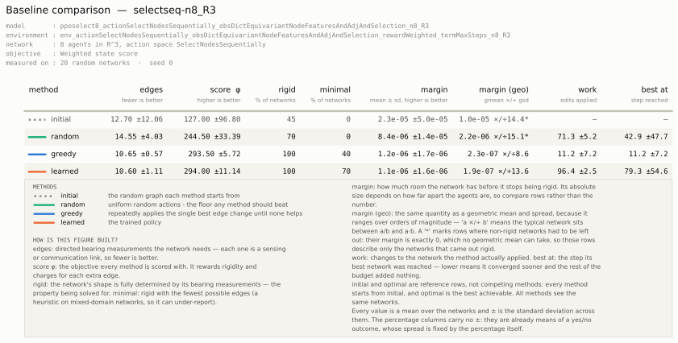
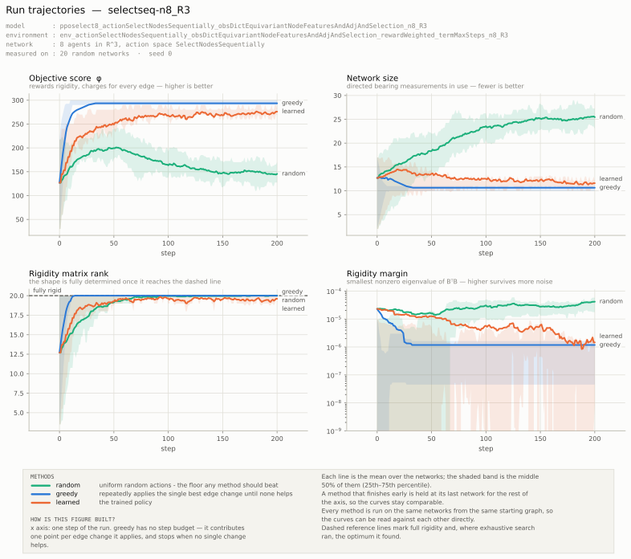
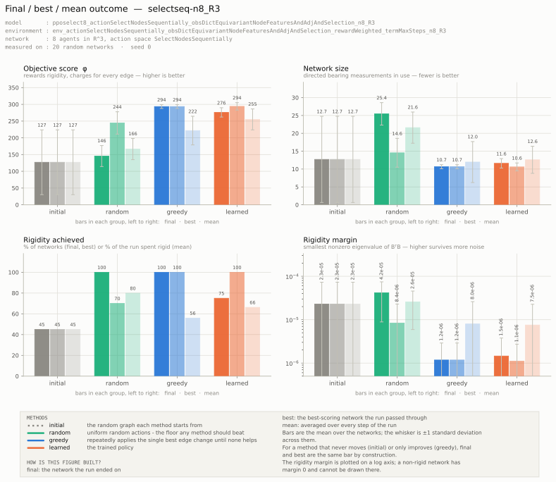
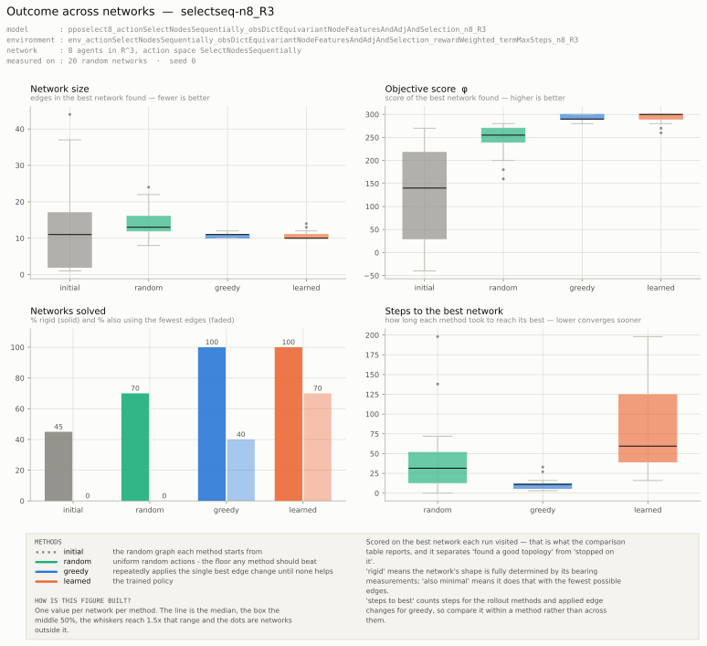

# rigidity_rl

> **Note:** this README was generated by Claude and manually verified.
>
> **This project is a work in progress.** Interfaces, configuration formats and model
> architectures change frequently. The repository also contains superseded code and older
> experimental work that is no longer part of the active pipeline.

---

## See also

- [Draft presentation](resources/rigidity_rl_260807-1.pdf) — slides on the current state of this work.
- [Michieletto et al. (2021), *A Unified Dissertation on Bearing Rigidity Theory*](resources/Michieletto%20et%20al.%20-%202021%20-%20A%20Unified%20Dissertation%20on%20Bearing%20Rigidity%20Theory.pdf) — the reference the rigidity theory in this repo follows.

## What is this?

Topology optimization for **bearing rigid multi-agent networks**, using deep reinforcement
learning with graph neural networks.

A multi-agent network is modelled as a **directed graph**. Each node is an agent with a pose
(position and orientation) and a *domain* that determines its degrees of freedom. A directed
edge `i -> j` means **agent `i` measures the bearing to agent `j`**, expressed in `i`'s local
frame — for orientation-less domains (`R^2`, `R^3`) that is simply the global frame. Edges are
therefore asymmetric, and each one represents a sensing/communication cost.

The reinforcement learning task is: given a set of agents at given poses, **choose the edge set**
so that the network is bearing rigid using as few edges as possible. A GNN encodes the graph into
node embeddings, and an action head turns those embeddings into logits (PPO) or Q-values (DQN)
shaped by the configured action space.

Supported agent domains: `R^2`, `R^3`, `R^2xS^1`, `R^3xS^1`, `SE(3)`. Networks may be
heterogeneous — the domain pair of an edge's endpoints determines which degrees of freedom that
bearing measurement actually constrains.

## Evaluation output

Every evaluation run measures the trained policy against reference points. The starting graph,
a random policy, and a greedy search in case of the examples below.









## Requirements

- Python 3.12
- An NVIDIA GPU — `setup.sh` installs CUDA 12.6 builds of PyTorch and the PyTorch Geometric
  extensions. The training scripts select `cuda` when available and `cpu` otherwise. Inference and `baselines.py` run on CPU by default.
- [`uv`](https://docs.astral.sh/uv/) for environment management (installed by `setup.sh` if
  missing)

Key dependencies: `torch`, `torch-geometric` (+ `pyg_lib`, `torch_scatter`, `torch_sparse`,
`torch_cluster`, `torch_spline_conv`), `skrl` (RL algorithms), `egnn-pytorch` (equivariant GNN),
`gymnasium`, `numpy-quaternion`, `viser` (3D visualisation), `tensorboard`.

## Setup

```bash
git clone git@github.com:nyanklc/rigidity_rl.git
cd rigidity_rl
./setup.sh
```

This installs `uv` if needed, creates a `.venv` on Python 3.12, and installs the dependencies.
`requirements.txt` records a full pinned freeze of a working environment for reference.

Everything is then run through `uv`:

```bash
uv run <script>.py <args>
```

There is no `pyproject.toml` or lockfile — the virtualenv is populated directly by `uv pip`.

## Quick start

Configuration of the environment and training can be done within the source code or generated '.json' files.

```bash
# 1. create an environment configuration (edit the constants in the __main__ block first)
uv run environment.py 4 "R^2"

# 2. train
uv run train_dqn.py env_actionSelectNodesSequentially_obs..._n4_R2 my_first_run

# 3. watch it train
tensorboard --logdir runs

# 4. compare it against reference points
uv run baselines.py env_actionSelectNodesSequentially_obs..._n4_R2 --model my_first_run

# 5. step through an episode in the browser
uv run inference.py my_first_run env_actionSelectNodesSequentially_obs..._n4_R2
```

Throughout, names are **filenames without extension**: `<environment_name>` resolves to
`environments/<name>.json`, `<scenario_name>` to `scenarios/<name>.json`, and `<model_name>` to
`train/<name>.json` plus `models/complete/<ALGO>/<name>.pt`.

## Core concepts

### Bearing rigidity

A framework is **Infinitesimally Bearing Rigid (IBR)** when the bearing measurements determine the
formation's shape up to translation and scale. This is tested through the *extended bearing
rigidity matrix* `B` (shape `3m x 6n` for `m` edges and `n` agents): the graph is IBR when
`rank(B)` equals the rank of the fully-connected graph's matrix on the same poses.

Two derived quantities are used throughout:

- **Rigidity eigenvalue** — the first nonzero eigenvalue of `B^T B`. A scalar measure of *how
  robustly* rigid a framework is. Its absolute magnitude is not meaningful on its own — matrix
  entries scale as `1/||p_ij||`, so it moves with the pose range `random_scenario` draws from
  (`pos_limits`, currently `[-1, 1]`). Compare frameworks at the same scale, and plot on a log axis.
- **Minimal Bearing Rigidity (MBR)** — whether the graph is rigid with as few edges as possible.
  Exact via a closed form for homogeneous `R^d` networks; otherwise a greedy per-edge lower bound
  is used.

### The environment

One `gymnasium.Env` (`Environment` in `environment.py`) serves every experiment. Nothing is
subclassed — behaviour is selected by string names in a JSON config, each dispatched to a
module-level function:

| Axis | Config key | Meaning |
|---|---|---|
| Action space | `action_type` | what a single step does to the graph |
| Observation | `obs_type` | what the policy sees |
| State score | `state_score_type` | the scalar φ measuring how good a graph is |
| Termination | `termination_condition_type` | when an episode ends |

Currently in active use:

- **Action spaces** — `SelectNodesSequentially` (pointer-network style: pick one node per step;
  every second pick toggles the edge between the two picks) and
  `AddRemoveEdgeDiscreteNoSelfLoops` (pick an edge and an add/remove operation directly).
- **Observation types** — `DictEquivariantNodeFeaturesAndAdjAndSelection` (feeds the EGNN
  backbone; includes raw coordinates) and `DictNodeFeaturesAndEdgeFeaturesAndAdjAndSelection`
  (feeds the GINE backbone). Both provide node features (domain one-hot, in/out degree,
  closeness / eigenvector centrality, betweenness), edge features (bearing vector, edge
  betweenness, reciprocity, common neighbours), the adjacency matrix, and the current selection.
- **State score** — `Weighted`, currently `20 * rank(B) - 10 * |E|`.
- **Termination** — `MaxSteps` (fixed horizon) or `MinimallyRigid`.

**Reward.** Each step yields

```
reward = -time_penalty + [action reward] + (φ(s') - φ(s)) + [terminal bonus]
```

The φ term is potential-based shaping: the reward is how much *better* the graph became, not its
absolute quality.

**Episode reset** re-randomises poses *and* edges, so a policy must generalise across geometries
rather than memorise one.

### Policies

`policy/gnn_backbone.py` holds the GNN backbones; `policy/{actor,critic,q_func}/` hold one model
per (backbone × action-space) combination, all re-exported from `policy/__init__.py`.

- `GNNBackboneEquivariant` — E(n)-equivariant GNN (EGNN). Preserves the node feature width;
  `gnn_hidden_dim` sets only the internal message width.
- `GNNBackboneGINE` — GINE, edge-feature aware. Outputs `gnn_hidden_dim`.

Naming: `Equivariant_*` = EGNN, `GINE_*` = GINE. **Action masking happens inside the model** —
invalid actions get `-1e9` written into their logit/Q-value; the environment does not mask. DQN
Q-networks additionally mask inside `random_act()` so ε-greedy exploration respects it too.

## Commands

### Creating configurations

```bash
# environment config -> environments/env_<...>.json
uv run environment.py <n> <domain>            # e.g. uv run environment.py 4 "R^2"
uv run environment.py file <scenario_name>    # take n and domains from a scenario

# scenario (fixed poses/domains) -> scenarios/<name>.json
uv run scenario.py <name>
```

Both scripts read their settings from constants at the top of their `__main__` block — **edit
those first**, then run. The generated environment filename encodes the chosen axes.

### Training

```bash
uv run train_ppo.py <environment_name> <model_name>
uv run train_dqn.py <environment_name> <model_name>
```

- `<model_name>` may be given as `prefix=foo`, which appends the action/obs type and `n_domain`
  automatically.
- If a run of that name exists you are prompted to **continue**, start **fresh**, or **abort**.
- Hyperparameters live in the constants block at the top of each training script.

Outputs: `models/complete/{PPO,DQN}/<name>.pt`, a run manifest at `train/<name>.json`, and
TensorBoard logs in `runs/<name>/`.

### Monitoring

```bash
tensorboard --logdir runs
```

Beyond the usual reward/loss curves, the environment logs an `Episode/ *` group — **one point per
tag per episode**, written when the episode ends and plotted against the global environment step so
it lines up with skrl's own curves. Each episode contributes three views of itself:

- **`Final *`** — the graph the episode ended on (`Final state score`, `Final nr edges`,
  `Final rank`, `Final rank deficit`, `Final is rigid`, `Final is min rigid`, `Final min eig`),
  plus `Nr initial edges`, `Edge delta`, `Length`, `Nr edits`, `Skip fraction`, `Terminated`
  and the return decomposition.
- **`Best *`** — the highest-scoring graph *seen* during the episode and the step it was reached
  at (`Best state score`, `Best nr edges`, `Best rank`, `Best is rigid`, `Best is min rigid`,
  `Best min eig`, `Best step`). Scoring an episode on its final state alone conflates finding a
  good topology with learning to stop on one; `Best-final score gap` measures exactly that
  difference — 0 means the episode ended on the best graph it found.
- **`Mean *` / fractions** — the episode average (`Mean state score`, `Mean nr edges`, `Mean rank`,
  `Mean min eig`, `Rigid fraction`, `Min rigid fraction`), i.e. what the graph looked like
  throughout rather than at one instant.

### Evaluation

```bash
uv run baselines.py <environment_name> [options]
```

Scores several methods on identical problem instances, all through the same φ the agent trains on:

| Method | What it does |
|---|---|
| `initial` | the graph the sampler produced |
| `random` | uniform random actions; the floor for that action space |
| `greedy` | hill-climbing on φ, one edge toggle at a time |
| `learned` | a trained policy (requires `--model`) |
| `optimal` | exhaustive search for the fewest-edge rigid graph (`--brute-force`, small `n` only) |

Options: `--episodes N`, `--model <name>`, `--brute-force`, `--steps K` (rollout horizon),
`--methods a,b,c`, `--policy-mode sample|greedy`, `--seed`, `--device`, `--tag <label>`,
`--out-dir PATH`, `--no-plots`, `--plot-episodes N`, `--brief`, `--replay-env`.

Each run writes one self-describing directory:

```
runs_baselines/<timestamp>__<environment>__<model>/
  summary.txt        the printed comparison table and its legend
  results.csv        one row per (episode, method) — the final outcome
  trajectories.csv   one row per (episode, method, step) — the full time series
  meta.json          arguments, environment config, versions, seed, git state
  plots/pdf/         table, trajectories, outcomes, summary and per-episode figures
  plots/png/         the same figures as PNG
```

Every figure is written in both formats and filed by format — PDF for the thesis, PNG for
looking at.

The table reports, per method: edges used, objective score, the percentage of networks that came
out rigid and minimally rigid, the rigidity margin, **work** (how many changes to the network the
method actually made) and **best@** (the step at which its best network was found). A legend
below the table explains each column in plain language; `--brief` omits it.

Every value is a mean over the networks with its standard deviation, except the percentage
columns — those are already means of a yes/no outcome, so their spread carries no extra
information. The margin appears twice: arithmetically (`mean ± sd`) and geometrically
(`gmean ×/÷ gsd`), since it ranges over orders of magnitude and an arithmetic ± implies a range
crossing zero. The geometric column is marked `*` when non-rigid networks had to be excluded —
their margin is exactly 0, which a geometric mean cannot take, so a starred row describes only
the networks that came out rigid.

Four figures cover the run, each with the full environment and model names in its title block and
a notes card explaining how it was built:

- **`table`** — the comparison table itself, the same numbers as `summary.txt` but laid out:
  each column states its direction under its name, reference rows are drawn as reference rows,
  and the column legend rides along in the card. Use it when the table has to appear beside the
  plots rather than in a terminal.
- **`trajectories`** — objective score, edge count, rigidity-matrix rank and rigidity margin
  against step, for every method, with full rigidity and the exhaustive optimum as reference lines.
  Mean across networks with the middle 50% shaded; `episode_NNN` is the same figure for one network.
- **`outcomes`** — **final / best / mean** side by side for every method: the network the run ended
  on, the best-scoring one it passed through, and the average over the run. The same three views
  the environment logs per episode to TensorBoard. A method whose `best` bar stands well above its
  `final` bar found a good topology and then moved off it.
- **`summary`** — the spread across networks (box plots) of the outcome each method is scored on,
  the percentage rigid and minimally rigid, and how long each method took to reach its best.

Per-step tracing is what makes these possible and costs roughly 20–30% per step, so `--no-plots`
disables both.

**`--policy-mode`** controls how the trained policy is rolled out, and the two modes measure
different things:

- `sample` (default) — actions are sampled from the policy. Combined with best-state-visited
  scoring over the horizon, this uses the policy as a *sampling-based search*, which is the usual
  inference procedure for neural combinatorial optimization. Reproducible for a given `--seed`,
  but the result depends on the rollout budget, so report it together with `--steps`.
- `greedy` — the single action the policy considers best. This is what a deployed policy would do,
  is reproducible regardless of seed, and terminates as soon as the trajectory repeats a state
  (a deterministic policy in a deterministic environment is eventually periodic).

A DQN Q-network has no distribution to sample from and takes the argmax in either mode; the
distinction only affects PPO.

`greedy` is the expensive baseline — it evaluates all `n(n-1)` candidate toggles per improvement,
so cost grows quadratically in `n`. Drop it with `--methods` on large graphs. Brute force refuses
above `n = 5`.

### Inference and manual editing

```bash
uv run inference.py <model_name> <environment_name>   # step through an episode in viser
uv run manual.py <environment_name>                   # hand-edit a graph, watch rigidity metrics
```

Both open a [viser](https://viser.studio) server in the browser. `inference.py` advances one step
per button press (or spacebar) and, with `BRUTE_FORCE_BEST` enabled, opens a second server showing
the exhaustively-optimal topology for comparison.

## Run manifests and reproducibility

Every training run writes `train/<model_name>.json` — a **self-contained record of that run**.
`train/` is gitignored, so a manifest lives only on the machine that produced it; keep it
alongside the checkpoint it describes. Each contains:

- hyperparameters and the environment configuration used
- the **source code** of the actor/critic/Q-network classes
- the **full text** of every file that determines the model — `environment.py`, `network.py`,
  `rigidity.py`, `util.py`, `scenario.py`, `policy/gnn_backbone.py` — gzipped and base64-encoded
  into `sources_b64gz`
- `scenario_raw`, the scenario contents (`scenarios/` is gitignored, so a run naming one would
  otherwise be unreplayable)
- `provenance`: git commit and dirty flag, command line, package versions, device, random seed

Because the code is archived, a checkpoint keeps working after the repository moves on. When
loading, the tools compare the archived sources against the working tree; if they differ, the
difference is reported and the model — and, where necessary, the **environment it was trained
against** — is rebuilt from the archive rather than from current code.

```bash
uv run manifest.py list                  # every run: what it carries, whether it still verifies
uv run manifest.py show <name> [file]    # print archived source and provenance
uv run manifest.py diff <name> [file]    # archived vs the working tree
uv run manifest.py verify <name>         # rebuild the model from the archive, check the weights
uv run manifest.py backfill [--write]    # add missing information to older manifests
```

`backfill` only archives current sources for a run whose weights they demonstrably reconstruct
(checked against the saved parameter shapes); such entries are marked
`provenance.captured_at_training: false`. Runs that cannot be reconstructed are marked
`reconstructible: false` with the reason instead.

Checkpoints predating the manifest system are recovered by reading the architecture back out of
the checkpoint's parameter shapes, then finding the matching model class in `policy/`.

## Repository layout

```
environment.py          the gymnasium environment; action / observation / reward / termination dispatch
network.py              Agent and Network; graph features used by the observations
rigidity.py             bearing rigidity matrix, IBR / MBR tests, rigidity eigenvalue
scenario.py             random and file-backed scenario generation
util.py                 Pose and geometry helpers

policy/
  gnn_backbone.py       EGNN and GINE backbones
  actor/ critic/ q_func/  one model per (backbone x action space)

train_ppo.py            PPO training
train_dqn.py            DQN training
agent_loader.py         rebuild a trained agent (and its environment) from a manifest
manifest.py             build, inspect, verify and backfill run manifests
baselines.py            reference points: initial / random / greedy / learned / optimal
inference.py            step through an episode with a trained model
manual.py               interactive graph editor
visualizer.py           viser wrapper

environments/           environment configs      (gitignored)
scenarios/              fixed poses/domains      (gitignored)
models/                 checkpoints              (gitignored)
runs/                   TensorBoard logs         (gitignored)
runs_baselines/         evaluation output        (gitignored)
resources/              papers, slides, README figures
train/                  run manifests            (gitignored)
```

`gpu_environment.py`, `gpu_network.py` and `gpu_rigidity.py` are an in-progress batched PyTorch
reimplementation of the environment and rigidity maths; they are not yet wired into training.

The repository also contains superseded scripts and older experimental work that are no longer
part of the active pipeline.

## License

MIT — see [LICENSE](LICENSE).
