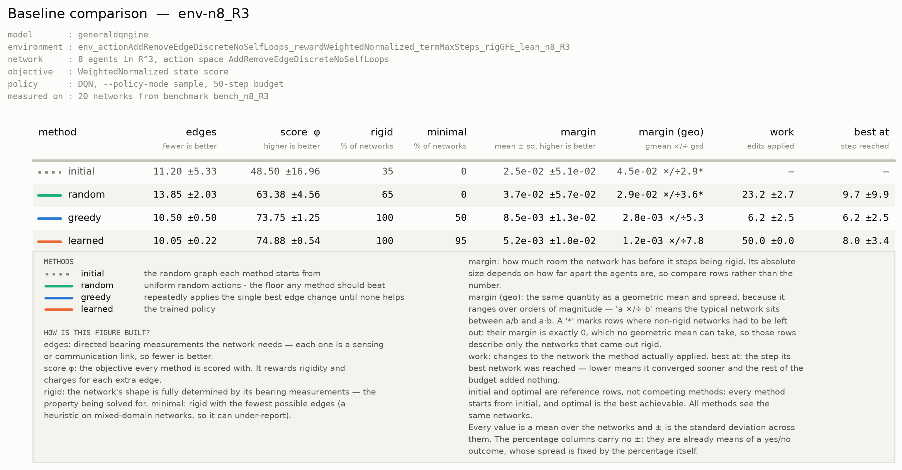
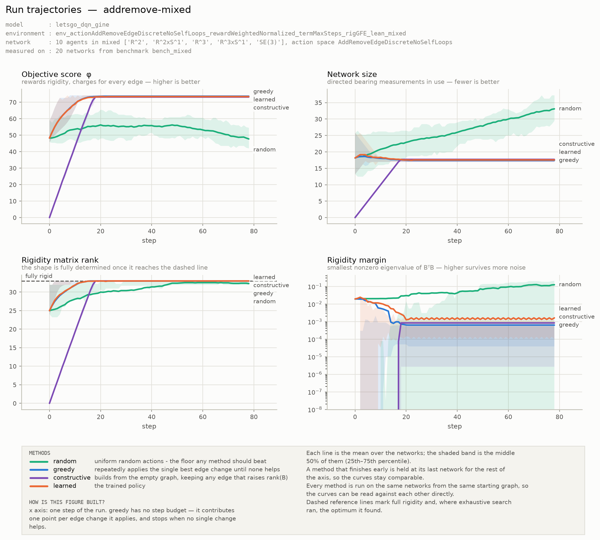
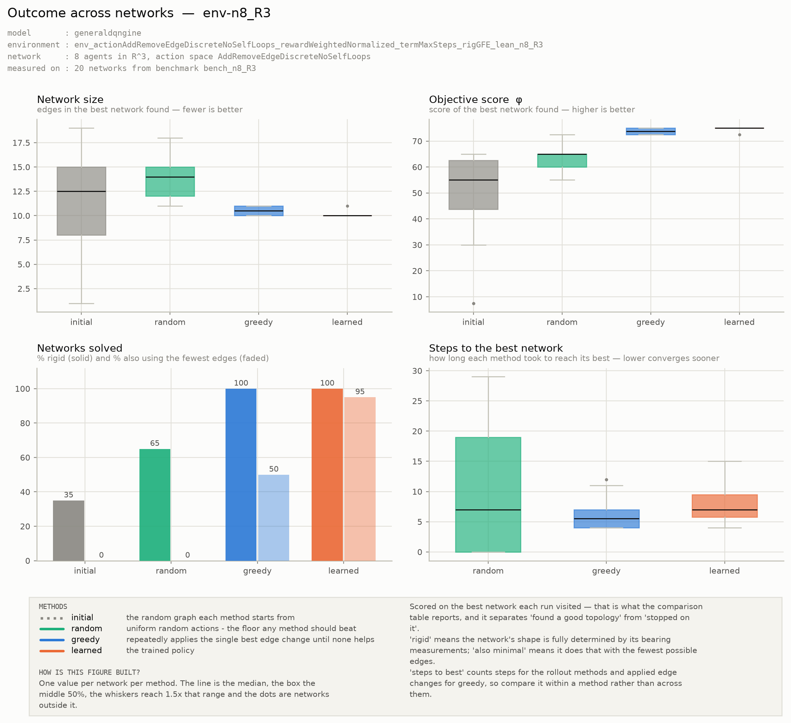
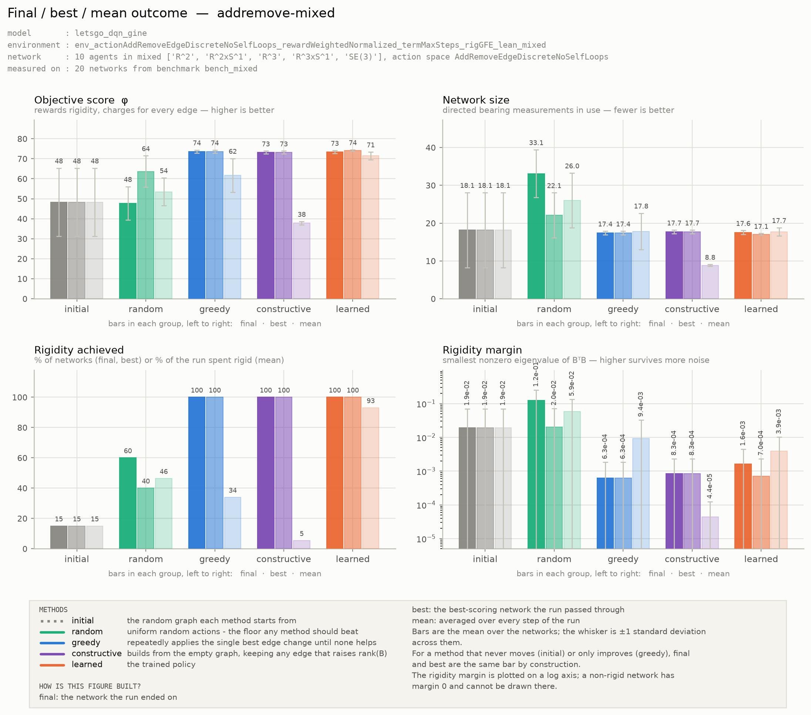

# Network Topology Optimization for Bearing Rigid Multi-Agent Systems via Deep Reinforcement Learning and Graph Neural Networks

Master's thesis, University of Padova. Noyan Erdin Kilic.

A team of robots that can only measure *directions* to one another (bearings, from cameras rather
than range sensors) can recover its own shape only if the graph of who-measures-whom is rich
enough. Adding every possible measurement makes that trivial and is wasteful: each link costs
sensing, tracking and communication. This thesis asks which links to keep, and learns the answer
with a graph neural network trained by reinforcement learning, rather than deriving it by hand for
each network.

**Status: work in progress.** Interfaces, configuration formats and model architectures change
frequently, and the repository carries superseded code from earlier experiments.

## Main References

Bearing rigidity theory, and the source of the rigidity matrix formulation used here:

1. The extended bearing rigidity matrix used here restricts degrees of freedom per node rather than
   per edge, which only matters once a formation mixes domains. The construction, and why it differs
   from the one in [2], are written up in
   [docs/dof_restriction_note.pdf](docs/dof_restriction_note.pdf).
2. G. Michieletto, A. Cenedese, and D. Zelazo, "A Unified Dissertation on Bearing Rigidity Theory,"
   *IEEE Transactions on Control of Network Systems*, vol. 8, no. 4, pp. 1624-1636, Dec. 2021.
   [doi:10.1109/TCNS.2021.3077712](https://doi.org/10.1109/TCNS.2021.3077712)
3. M. H. Trinh, Q. Van Tran, and H.-S. Ahn, "Minimal and Redundant Bearing Rigidity: Conditions and
   Applications," *IEEE Transactions on Automatic Control*, vol. 65, no. 10, pp. 4186-4200,
   Oct. 2020. [doi:10.1109/TAC.2019.2958563](https://doi.org/10.1109/TAC.2019.2958563)

Combinatorial structure of the objective:

4. L. A. Wolsey, "An analysis of the greedy algorithm for the submodular set covering problem,"
   *Combinatorica*, vol. 2, no. 4, pp. 385-393, 1982.
   [doi:10.1007/BF02579435](https://doi.org/10.1007/BF02579435)

Reinforcement learning over graph structure:

5. V.-A. Darvariu, S. Hailes, and M. Musolesi, "Graph Reinforcement Learning for Combinatorial
   Optimization: A Survey and Unifying Perspective," *Transactions on Machine Learning Research*,
   Aug. 2024. [arXiv:2404.06492](https://arxiv.org/abs/2404.06492)
6. V.-A. Darvariu, S. Hailes, and M. Musolesi, "Goal-directed graph construction using reinforcement
   learning," *Proceedings of the Royal Society A*, vol. 477, no. 2254, 2021.
   [doi:10.1098/rspa.2021.0168](https://doi.org/10.1098/rspa.2021.0168)

Architectures:

7. V. G. Satorras, E. Hoogeboom, and M. Welling, "E(n) Equivariant Graph Neural Networks,"
   *ICML*, 2021. [arXiv:2102.09844](https://arxiv.org/abs/2102.09844)
8. K. Xu, W. Hu, J. Leskovec, and S. Jegelka, "How Powerful are Graph Neural Networks?," *ICLR*,
   2019. [arXiv:1810.00826](https://arxiv.org/abs/1810.00826)

A [draft presentation](resources/rigidity_rl_260807-1.pdf) covers the same material with figures.

## Problem

A formation of `n` agents is modelled as a **directed graph**. Each node is an agent with a pose
and a *domain* fixing which degrees of freedom it actually has: `R^2`, `R^3`, `R^2xS^1`, `R^3xS^1`
or `SE(3)`. A planar ground robot cannot leave its plane; a quadrotor with a fixed-axis gimbal can
rotate about one axis only. A directed edge `i -> j` means agent `i` measures the bearing to agent
`j`, in `i`'s own frame. The relation is not symmetric: `i` seeing `j` does not imply `j` sees `i`.

A framework is **infinitesimally bearing rigid** when those measurements pin down the formation's
shape, leaving only the motions that no bearing can detect (translation, uniform scaling, and,
where every agent carries its own frame, global rotation). The test is algebraic: rigid exactly
when the rigidity matrix `B` attains the rank of the complete graph on the same poses.

The optimization problem is then:

> Given `n` agents at given poses, with given domains, choose the directed edge set so the
> framework is bearing rigid, using as few edges as possible, and among the sparsest solutions
> preferring the one whose shape is best conditioned against measurement noise.

Two properties make this harder than it first appears. Agent domains can be **mixed** within one
network, and the pair of domains at an edge's endpoints decides which degrees of freedom that
measurement constrains. And sparsity alone is not a sufficient criterion: many edge sets of the
same minimal size are rigid at the same poses, and they differ by five orders of magnitude in how
sharply the bearings respond to a change in shape - every one of them recovers the shape from exact
measurements, but the error under noisy ones scales as the inverse square root of that quantity.

## Research questions

1. Is there an optimal graph topology balancing sparsity against structural rigidity, and what
   characterizes it?
2. Can deep reinforcement learning construct such a topology, and what architecture and training
   procedure does that require?
3. Does a learned policy generalize to networks it was not trained on: different sizes, different
   agent domains, heterogeneous compositions?
4. Where does a learned policy earn its place against classical combinatorial heuristics, and where
   does it not?

Question 3 is the central claim the thesis aims at, a single policy for any `n` and any domain
mix, and is currently the open problem. Question 4 is treated as a genuine question rather than a
rhetorical one: part of the contribution is identifying the regime in which learning helps, and
saying plainly where a greedy algorithm is already optimal.

## Approach

The task is cast as a Markov decision process over edge sets. A state is a set of agent poses plus
the current graph; an action edits one directed edge; the reward is the improvement in a scalar
objective `phi` that rewards rigidity rank and charges for each edge. A graph neural network encodes
the network into node embeddings, and an action head turns those into Q-values (DQN) or logits
(PPO). Invalid actions are masked inside the model.

Design choices that carry the argument:

- **The objective is dimensionless.** `phi` is normalized by quantities computed from the poses
  themselves, so the same number means the same thing at any network size and in any domain. A
  score that changes units between configurations cannot support a claim about generalization.
- **The policy sees candidate geometry.** Bearings are supplied for every ordered pair, not only
  for existing edges, so the network can reason about a measurement it does not yet have.
- **Rigidity-derived features are an ablation arm, not a default.** Quantities like the rigidity
  matrix rank are global and expensive, and no distributed agent could compute them. They are
  switchable, so the gap between the informed and uninformed policy is itself a measurement of how
  much rigidity structure a GNN can recover from geometry alone.

The longer-term motivation is a *distributed* protocol for maintaining rigid formations in swarms.
The centralized formulation here is a deliberate first step;
[DESIGN_NOTES.md](DESIGN_NOTES.md#distributed-feasibility) assesses what would carry over and what
provably would not.

## Current state

Results move as the formulation changes; these are the current ones.

**Works.** On heterogeneous networks of 10 agents spanning all five domains at once, a trained DQN
policy reaches 17.05 edges against a proven lower bound of 17, rigid on every instance of a frozen
20-instance benchmark and minimal on 95% of them. Greedy hill-climbing on the same objective and
the same instances reaches 80%, and a 20-restart constructive-greedy oracle reaches 50%. The policy
gets there with roughly 270x fewer rigidity-matrix evaluations than the oracle.

**Transfer degrades with agent complexity.** Without retraining the policy runs at 5, 8 and 16
agents. At 8 agents in homogeneous `R^3` it ties both classical baselines, reaching 50% minimal
where a random policy reaches 0%; at 16 it ties the weaker one and loses to greedy (23.20 edges and
0% minimal against 22.65 and 45%). The one configuration where it beats both classical methods is
the heterogeneous mixture it trained on. Across homogeneous domains at 8 agents,
however, transfer tracks the degrees of freedom each agent carries: it matches the baselines at 3
DOF per agent (`R^3`, `R^2xS^1`) and fails at 4 and 6 (`R^3xS^1` 10% minimal against 85-100% for the
baselines, `SE(3)` 25% against 100%). On `SE(3)` it scores below a uniform random policy on the
objective while remaining rigid everywhere, so the failure is over-density rather than
infeasibility.

The edge-count trajectory identifies what breaks. Wherever the policy works it prunes downward
toward the bound (18.1 to 17.6 on the training mixture, 11.2 to 10.6 at 8 agents in `R^3`); where it
fails it never enters a pruning phase and climbs instead, by +1.5 edges at 4 DOF and +8.2 at 6. It
reaches rigidity there by accumulation rather than by construction.

The leading explanation is coverage: the training mixture holds two agents of each domain, so
high-DOF agents are never in the majority, and the policy handles exactly those agents well when
they are a minority. That is not yet established against a capacity explanation, and separating them
is the next experiment. Generalization across agent domains remains the oldest open problem here and
is not resolved by these results.

**Not yet tested: the geometry.** Channel-wise ablation, run in three independent modes, shows
the policy solves the problem from graph structure alone and reads no geometry at all. Destroying
the bearings, the agent coordinates and the null-space channels costs it nothing in any mode. That
is the correct response to an objective that contains no geometric term, and the price is visible
in the figures below: the rigidity margin of the graphs it produces falls by an order of magnitude
over training, and a random policy ends up holding a better margin than any method that actually
solves the problem.

The objective has since been extended past the combinatorial rank: it can now charge for the
rigidity margin as well as for edges, weighted so that the margin is worth a stated number of edges.
On greedy hill-climbing, which needs no training, turning it on raises the margin of the resulting
networks by 2x to 20x at an unchanged edge count. No policy has been trained against it yet, and the
same channel ablation is the test that decides whether it works - the geometric channels have to
start costing something.

**Two findings that reframed the project.** The rank of the rigidity matrix is generically
independent of the agent configuration, which means a rank-based objective is purely combinatorial
and cannot motivate the geometric machinery usually paired with it. The ablation above is that
argument confirmed in a trained network. Separately, the standard heterogeneous rigidity matrix
construction attaches degree-of-freedom restrictions per edge rather than per node, which lets a
planar agent gain a degree of freedom it does not have; the corrected construction is validated
against its own definition by numerical differentiation and agrees exactly with the published one
on homogeneous networks. See [THEORY.md](THEORY.md) section 12.

Numbers reported here are single-seed unless stated otherwise, and measured run-to-run variance at
this scale is large. Treat them as indicative.

## Evaluation

Every trained policy is scored against the same reference points on the same networks: the graph it
started from, a uniform random policy, greedy hill-climbing on the same objective, a randomized
constructive greedy that builds from the empty graph and is the classical algorithm for this
problem, and, on networks small enough, exhaustive search for the true optimum. Instances are drawn
from a frozen benchmark set so a number measured today stays comparable to one measured months
later.



The learned policy reaches the minimal edge count on 95% of networks, against 80% for greedy
hill-climbing and 50% for constructive greedy on the same instances. Its spread is also the
narrowest of the three, so the mean is not an average over wildly different outcomes. The `work`
column is not a fair cost comparison for the policy: this configuration masks out the stop action,
so it is obliged to keep editing for the whole horizon. `best at` is the step it actually converged
on, and there it is comparable to greedy.



The learned policy and greedy both reach the optimum within about fifteen steps and hold it, while
constructive greedy starts from nothing and climbs to the same place, and a random policy
accumulates edges without ever becoming reliably rigid. The rigidity margin panel is the one that
sets up the next stage of the work: the random policy holds a margin two orders of magnitude better
than every method that actually solves the problem, because the objective charges for each edge and
pays nothing for robustness.



Per network rather than averaged over them. The learned policy collapses to a flat line at 17 edges
with a single outlier: it lands on the same answer almost every time. Greedy and constructive are
rigid just as often and minimal on fewer networks, and the spread of their edge counts is visibly
wider.



Three views of each run: the network it ended on, the best one it passed through, and the average
over every step. The gap between the first two bars is the difference between finding a good
topology and stopping on it. Here it is structural rather than a failure, since the stop action is
masked and the policy cannot hold still; the metric it is scored on is the best graph visited.

All four figures are written in both PNG and PDF for every evaluation run.

## Documentation

| File | Contents |
|---|---|
| [THEORY.md](THEORY.md) | the mathematics: rigidity matrix, rank, null space, objective |
| [DESIGN_NOTES.md](DESIGN_NOTES.md) | why the implementation is the way it is |
| [CLAUDE.md](CLAUDE.md) | code map and working conventions |
| [ROADMAP.md](ROADMAP.md) | what is planned next |
| [docs/](docs/) | note on the heterogeneous rigidity matrix, with verification scripts |

## Running the code

Requires Python 3.12, an NVIDIA GPU, and [`uv`](https://docs.astral.sh/uv/).

```bash
./setup.sh          # installs uv if needed, creates .venv, installs dependencies
```

```bash
uv run environment.py 8 "R^3"          # generate an environment configuration
uv run train_dqn.py <env_name> <run_name>
uv run baselines.py <env_name> --model <run_name>    # against random, greedy, optimal
tensorboard --logdir runs
```

Names are filenames without extension. `uv run tests/run_all.py` runs the test suite, which pins
the invariants this project keeps breaking, and passes on a fresh clone. `CLAUDE.md` lists every
entry point.

## Repository layout

```
rigidity.py         bearing rigidity matrix, rigidity tests, derived quantities
network.py          Agent and Network, graph features
environment.py      the gymnasium environment and its dispatchers
scenario.py         random and file-backed scenario generation
policy/             GNN backbones and one model per (backbone x action space)
train_dqn.py        training (train_ppo.py for PPO)
baselines.py        evaluation against random, greedy and exhaustive search
benchmark.py        frozen evaluation instances, so results stay comparable
manifest.py         run manifests: archived sources and provenance
tests/              invariant tests
tools/              scripts worth keeping: verifications, ablations, measurements
docs/               the rigidity-matrix note and its verification scripts
```

Directories produced by runs (`environments/`, `models/`, `runs/`, `train/`) are not tracked.

## License

MIT, see [LICENSE](LICENSE).
